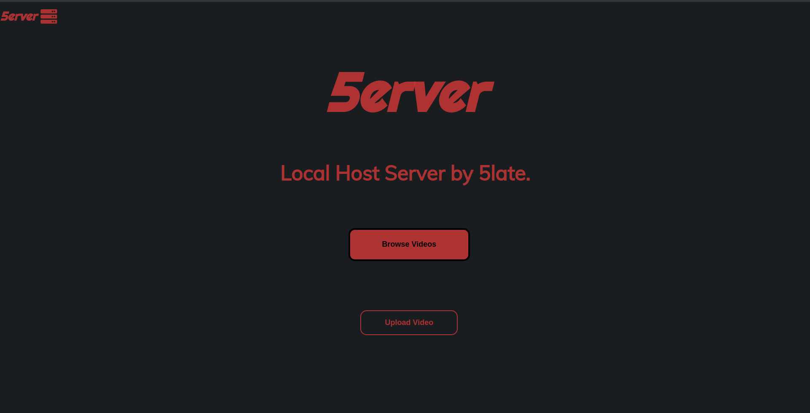
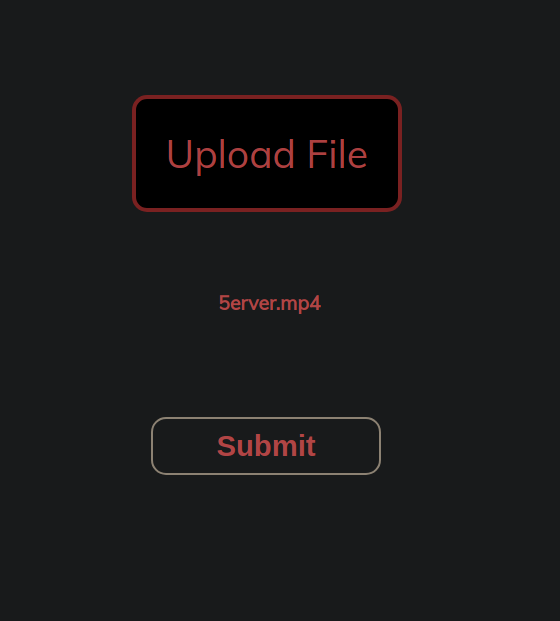
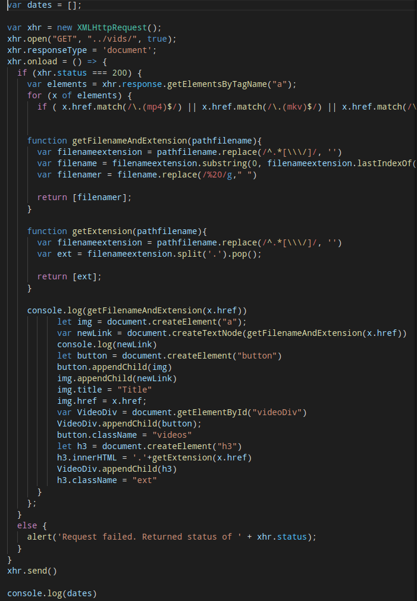

# 5erver

5erver v2.0 release! [Read More](https://github.com/5late/5erver#5erver-20)

## What is 5erver?

**5erver is the local host file server for everyone.**

- 5erver allows you to be in full control of your data.
- 5erver allows anyone on your wifi to see the files, but no one outside can.
- 5erver2 allows you to upload files *directly* from the website, rather than using the previous long command line input.
- 5erver is stylized to be easy on the eyes, while providing enough detail to show you exactly what you need, whenever you see it. 
- 5erver is customizable.

## Installation

Go to [this link](https://drive.google.com/file/d/1wv_pCZj_63F5YdekDLOGboFvkIPzhw7Z/view?usp=sharing) to view the quick start instructions to install and set up 5erver.

You can also go to the quickstart folder in this repository and view the quick start instructions there.

## 5erver 2.0

5erver2.0 comes with a lot of new features, bug fixes, and more effiecent code.

### New features include:
- Facelifted landing sight
- ***Much*** easier to use uploading system.
- More reliable uploading to the Pi.
- Faster upload times.
- Newer, faster JavaScript.
- A backend.

**Old 5erver**

**New 5erver**

**Old 5erver Upload**

**New 5erver Upload**

**Old 5erver JavaScript**

**New 5erver JavaScript**

## Acknowledgements

- Legends for UI
    - fork & giv for styling

# License

**Licensed under the Apache2.0 license.**
Visit the [LICENSE file](LICENSE) for more information.